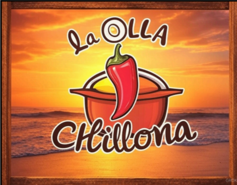
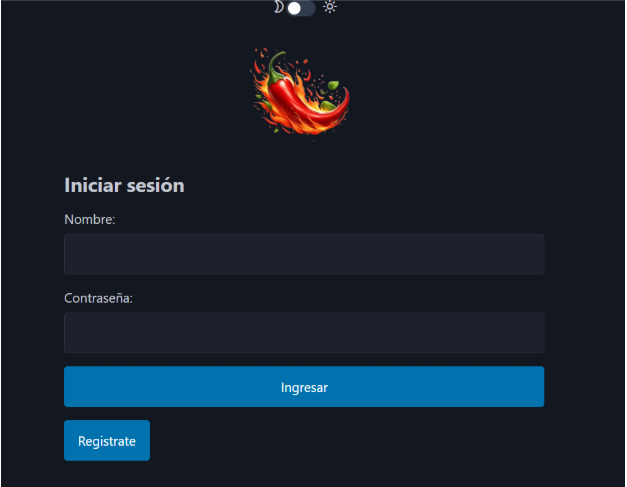
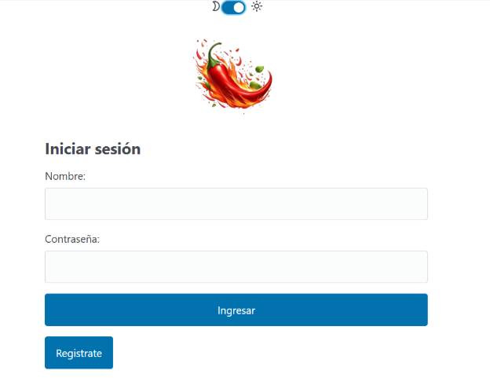

# **Documentación de Olla chillona**

Índice:

[**1\. Introducción	3**](#1.-introducción)

[Login	3](#login)

[**2\. Requisitos e instalación	4**](#2.-requisitos-e-instalación)

[Instalación:	4](#instalación:)

[**3\. Estructura del Proyecto	6**](#3.-estructura-del-proyecto)

[**4\. Modelos (Base de Datos)	6**](#4.-modelos-\(base-de-datos\))

[UsuarioPersonalizado	6](#usuariopersonalizado)

[Plato	6](#plato)

[Descuento	7](#descuento)

[Reserva	7](#reserva)

[Menú	7](#menú)

[Servicio	8](#servicio)

[**5\. Vistas y Funcionalidad	8**](#5.-vistas-y-funcionalidad)

[Autenticación	8](#autenticación)

[Panel de Usuario	9](#panel-de-usuario)

[Gestión de Platos	9](#gestión-de-platos)

[Gestión de Descuentos	9](#gestión-de-descuentos)

[Gestión de Reservas	9](#gestión-de-reservas)

[Gestión de Servicios	9](#gestión-de-servicios)

[**6\. URLs	10**](#6.-urls)

[Autenticación y Panel de Control	10](#autenticación-y-panel-de-control)

[Gestión de Platos	10](#gestión-de-platos-1)

[Gestión de Descuentos y Menús	10](#gestión-de-descuentos-y-menús)

[Reservas y Servicios	11](#reservas-y-servicios)

[**7\. Templates	11**](#7.-templates)

[Formulario para Añadir un Descuento	11](#formulario-para-añadir-un-descuento)

[Formulario para Crear un Menú	11](#formulario-para-crear-un-menú)

[Formulario para Añadir un Plato	12](#formulario-para-añadir-un-plato)

[Formulario para Recargar Saldo	12](#formulario-para-recargar-saldo)

[Formulario para Crear un Servicio	12](#formulario-para-crear-un-servicio)

[Dashboard del Camarero	13](#dashboard-del-camarero)

[Dashboard del Cliente	13](#dashboard-del-cliente)

[Dashboard del Cocinero	13](#dashboard-del-cocinero)

[Dashboard del Jefe	13](#dashboard-del-jefe)

[Detalles del Plato	14](#detalles-del-plato)

[Formulario para Editar un Plato	14](#formulario-para-editar-un-plato)

[Historial de Servicios	14](#historial-de-servicios)

[Listado de Menús	14](#listado-de-menús)

[Listado de Platos	15](#listado-de-platos)

[Página de Login	15](#página-de-login)

[Página de Pago de Servicio	15](#página-de-pago-de-servicio)

[Página de Registro	15](#página-de-registro)

[**8\. Despliegue y Mantenimiento	16**](#8.-despliegue-y-mantenimiento)

[**9\. Dificultades encontradas.	16**](#9.-dificultades-encontradas.)

[**10\. Usuarios de la base datos.	17**](#10.-usuarios-de-la-base-datos.)

## 

# **1\. Introducción** {#1.-introducción}

Este proyecto es una aplicación web desarrollada con Django para la gestión del restaurante "La Olla Chillona". Permite a clientes, camareros, cocineros y al dueño del restaurante interactuar con el sistema para realizar reservas, gestionar pedidos y aplicar descuentos.

Algunas capturas de las diferentes pantallas:

## Login {#login}

Tenemos la funcionalidad para cambiar el tema de la aplicación mediante el selector de arriba del todo.

# **2\. Requisitos e instalación** {#2.-requisitos-e-instalación}

Antes de ejecutar el proyecto, asegúrate de tener instalado:

* Python 3.x  
* Django  
* Base de datos SQLite (predeterminada) o PostgreSQL

## Instalación: {#instalación:}

\# Crear un entorno virtual

python \-m venv venv

source venv/bin/activate  \# En Windows: venv\\Scripts\\activate

\# Configurar base de datos

python manage.py migrate

\# Ejecutar el servidor

python manage.py runserver

## 

# **3\. Estructura del Proyecto** {#3.-estructura-del-proyecto}

![][image4]

# **4\. Modelos (Base de Datos)** {#4.-modelos-(base-de-datos)}

## UsuarioPersonalizado {#usuariopersonalizado}

Este modelo extiende `AbstractUser` y permite la gestión de diferentes roles dentro del sistema.

**Atributos:**

* `usuario`: Nombre de usuario personalizado (máximo 15 caracteres).  
* `nombre`: Nombre del usuario (máximo 25 caracteres).  
* `apellidos`: Apellidos del usuario (máximo 50 caracteres).  
* `num_telefono`: Número de teléfono del usuario.  
* `saldo`: Saldo disponible en la cuenta del usuario (valor por defecto: 0).  
* `email`: Dirección de correo electrónico.  
* `password`: Contraseña del usuario (máximo 50 caracteres).  
* `rol`: Rol asignado al usuario (cliente, camarero, cocinero, jefe).

---

## Plato {#plato}

Este modelo representa un plato disponible en el restaurante.

**Atributos:**

* `nombre`: Nombre del plato (máximo 50 caracteres).  
* `descripcion`: Descripción detallada del plato.  
* `categoria`: Tipo de plato (carne, pescado, vegetariano, pizza).  
* `precio`: Precio del plato.  
* `imagen`: Imagen del plato (opcional).

---

## Descuento {#descuento}

Modelo para definir descuentos aplicables a los pedidos.

**Atributos:**

* `nombre`: Nombre del descuento (máximo 50 caracteres).  
* `porcent`: Porcentaje de descuento aplicado (valor por defecto: 0).

---

## Reserva {#reserva}

Modelo que almacena la información de las reservas realizadas por los clientes.

**Atributos:**

* `fecha`: Fecha de la reserva.  
* `hora`: Hora de la reserva.  
* `num_personas`: Número de personas en la reserva.  
* `usuario`: Usuario que realizó la reserva (relación con `UsuarioPersonalizado`).

---

## Menú {#menú}

Modelo que representa un menú compuesto por varios platos.

**Atributos:**

* `nombre`: Nombre del menú (máximo 200 caracteres).  
* `platos`: Lista de platos incluidos en el menú (relación `ManyToMany` con `Plato`).  
* `precio`: Precio total del menú.

---

## Servicio {#servicio}

Modelo para gestionar los servicios prestados a los clientes dentro del restaurante.

**Atributos:**

* `pagado`: Indica si el servicio ha sido pagado.  
* `finalizado`: Indica si el servicio ha finalizado.  
* `reserva`: Indica si el servicio incluye una reserva.  
* `usuario`: Usuario que solicitó el servicio (relación con `UsuarioPersonalizado`).  
* `menus`: Menús incluidos en el servicio (relación `ManyToMany` con `Menu`).  
* `platos`: Platos adicionales en el servicio (relación `ManyToMany` con `Plato`).  
* `precio_total`: Precio total del servicio.

---

# **5\. Vistas y Funcionalidad** {#5.-vistas-y-funcionalidad}

Las vistas manejan la lógica de negocio y la interacción con los usuarios del sistema.

## Autenticación {#autenticación}

* **`login_view(request)`**: Maneja el inicio de sesión de los usuarios.  
* **`logout_view(request)`**: Cierra la sesión del usuario actual.  
* **`register_view(request)`**: Permite a nuevos usuarios registrarse en el sistema.

## Panel de Usuario {#panel-de-usuario}

* **`dashboard(request)`**: Redirige al usuario a su panel según su rol (cliente, camarero, cocinero o jefe).

## Gestión de Platos {#gestión-de-platos}

* **`list_platos(request)`**: Muestra la lista de platos disponibles.  
* **`add_plato(request)`**: Permite añadir un nuevo plato al sistema.  
* **`detail(request, plato_id)`**: Muestra los detalles de un plato específico.  
* **`edita_plato(request, plato_id)`**: Permite editar los detalles de un plato.

## Gestión de Descuentos {#gestión-de-descuentos}

* **`add_descuento(request)`**: Agrega un nuevo descuento al sistema.  
* **`list_descuento(request)`**: Lista los descuentos disponibles.

## Gestión de Reservas {#gestión-de-reservas}

* **`add_reserva(request)`**: Permite a los clientes hacer una reserva.  
* **`list_reserva(request)`**: Muestra todas las reservas registradas.

## Gestión de Servicios {#gestión-de-servicios}

* **`add_servicio(request, usuario_id)`**: Crea un nuevo servicio asociado a un usuario.  
* **`pagar_servicio(request, servicio_id)`**: Permite a los clientes pagar un servicio.  
* **`historial_servicios(request)`**: Muestra el historial de servicios pagados por el usuario.

---

# **6\. URLs** {#6.-urls}

El archivo `urls.py` define las rutas para las vistas principales del sistema, conectando cada endpoint con su respectiva función en `views.py`.

## Autenticación y Panel de Control {#autenticación-y-panel-de-control}

* **`path("", views.login_view, name="login_view")`** → Página de inicio de sesión.  
* **`path("registro/", views.register_view, name="register_view")`** → Página de registro de usuario.  
* **`path("dashboard/", views.dashboard, name="dashboard")`** → Panel de control según el rol del usuario.

## Gestión de Platos {#gestión-de-platos-1}

* **`path("list_platos/", views.list_platos, name="list_platos")`** → Listado de todos los platos.  
* **`path("add_plato/", views.add_plato, name="add_plato")`** → Formulario para agregar un nuevo plato.  
* **`path("ver_plato/<int:plato_id>/", views.detail, name="detail")`** → Vista detallada de un plato específico.  
* **`path("edita_plato/<int:plato_id>/", views.edita_plato, name="edita_plato")`** → Edición de información de un plato.

## Gestión de Descuentos y Menús {#gestión-de-descuentos-y-menús}

* **`path("add_descuento/", views.add_descuento, name="add_descuento")`** → Agregar un nuevo descuento.  
* **`path("add_menu/", views.add_menu, name="add_menu")`** → Creación de menús.  
* **`path("list_menus/", views.list_menus, name="list_menus")`** → Listado de menús disponibles.

## 

## Reservas y Servicios {#reservas-y-servicios}

* **`path("add_reserva/", views.add_reserva, name="add_reserva")`** → Creación de una reserva.  
* **`path("add_saldo", views.add_saldo, name="add_saldo")`** → Añadir saldo a la cuenta del usuario.  
* **`path("add_servicio/<int:usuario_id>/", views.add_servicio, name="add_servicio")`** → Creación de un servicio vinculado a un usuario.  
* **`path("pagar_servicio/<int:servicio_id>/", views.pagar_servicio, name="pagar_servicio")`** → Pago de un servicio finalizado.  
* **`path("historial_servicios/", views.historial_servicios, name="historial_servicios")`** → Vista del historial de servicios pagados.

---

# **7\. Templates** {#7.-templates}

## Formulario para Añadir un Descuento {#formulario-para-añadir-un-descuento}

**Archivo:** `add_descuento.html`  
**Descripción:** Permite a los administradores añadir descuentos al sistema.  
**Elementos clave:**

* Formulario con campos para el nombre del descuento y porcentaje.  
* Uso de `csrf_token` para seguridad.  
* Botón de envío para crear el descuento.

---

## Formulario para Crear un Menú {#formulario-para-crear-un-menú}

**Archivo:** `add_menu.html`  
**Descripción:** Permite la creación de menús con selección de platos y un precio.  
**Elementos clave:**

* Formulario con campos para nombre, precio y lista de platos disponibles.  
* Checkbox para seleccionar platos.  
* Botón de envío para crear el menú.

---

## Formulario para Añadir un Plato {#formulario-para-añadir-un-plato}

**Archivo:** `add_plato.html`  
**Descripción:** Permite a los cocineros añadir un nuevo plato al sistema.  
**Elementos clave:**

* Formulario con campos dinámicos proporcionados por Django Forms.  
* Soporte para carga de imágenes.  
* Uso de `csrf_token` para protección.

---

## Formulario para Recargar Saldo {#formulario-para-recargar-saldo}

**Archivo:** `add_saldo.html`  
**Descripción:** Permite a los usuarios añadir saldo a su cuenta. **Elementos clave:**

* Campo para ingresar la cantidad de saldo a recargar.  
* Formulario seguro con `csrf_token`.  
* Botón de confirmación.

---

## Formulario para Crear un Servicio {#formulario-para-crear-un-servicio}

**Archivo:** `add_servicio.html`  
**Descripción:** Permite a los camareros gestionar y registrar servicios. **Elementos clave:**

* Selección de platos y menús.  
* Lista desplegable para seleccionar clientes.  
* Formulario con validaciones y protección `csrf_token`.

---

## Dashboard del Camarero {#dashboard-del-camarero}

**Archivo:** `dashboard_camarero.html`  
**Descripción:** Muestra las reservas asignadas al camarero y permite la creación de servicios. **Elementos clave:**

* Listado de reservas con botones de acción.  
* Botón para crear un servicio sin reserva.

---

## Dashboard del Cliente {#dashboard-del-cliente}

**Archivo:** `dashboard_cliente.html`  
**Descripción:** Interfaz del cliente para gestionar reservas y pagos. **Elementos clave:**

* Formulario para realizar reservas.  
* Listado de reservas y servicios pendientes de pago.  
* Botón para recargar saldo.

---

## Dashboard del Cocinero {#dashboard-del-cocinero}

**Archivo:** `dashboard_cocinero.html`  
**Descripción:** Vista que permite la gestión de platos en la cocina. **Elementos clave:**

* Botón para crear un nuevo plato.  
* Botón para listar los platos existentes.

---

## Dashboard del Jefe {#dashboard-del-jefe}

**Archivo:** `dashboard_jefe.html`  
**Descripción:** Interfaz del jefe para gestionar descuentos y menús. **Elementos clave:**

* Listado de descuentos.  
* Botón para crear un nuevo descuento.  
* Botón para crear un nuevo menú.

---

## Detalles del Plato {#detalles-del-plato}

**Archivo:** `detail.html`  
**Descripción:** Muestra la información detallada de un plato específico. **Elementos clave:**

* Información del plato como nombre, descripción, categoría y precio.  
* Imagen del plato si está disponible.  
* Botón para editar el plato.

---

## Formulario para Editar un Plato {#formulario-para-editar-un-plato}

**Archivo:** `edita_plato.html`  
**Descripción:** Permite editar la información de un plato existente. **Elementos clave:**

* Formulario con campos pre-rellenados con los datos del plato.  
* Selección de categoría y actualización de precio y descripción.  
* Uso de `csrf_token` para seguridad.

---

## Historial de Servicios {#historial-de-servicios}

**Archivo:** `historial_servicios.html`  
**Descripción:** Muestra los servicios consumidos por el usuario. **Elementos clave:**

* Lista de servicios con detalles de productos consumidos y precio total.  
* Mensaje de aviso si no hay servicios en el historial.

---

## Listado de Menús {#listado-de-menús}

**Archivo:** `list_menus.html`  
**Descripción:** Muestra todos los menús disponibles. **Elementos clave:**

* Lista de menús con sus nombres.  
* Botón de navegación para agregar un nuevo menú.

---

## Listado de Platos {#listado-de-platos}

**Archivo:** `list_platos.html`  
**Descripción:** Muestra todos los platos disponibles. **Elementos clave:**

* Lista de platos con enlaces a su vista detallada.  
* Mensaje si no hay platos disponibles.

---

## Página de Login {#página-de-login}

**Archivo:** `login.html`  
**Descripción:** Permite a los usuarios autenticarse en el sistema. **Elementos clave:**

* Formulario de inicio de sesión con usuario y contraseña.  
* Enlace a la página de registro.  
* Mensaje de error si las credenciales son incorrectas.

---

## Página de Pago de Servicio {#página-de-pago-de-servicio}

**Archivo:** `pagar_servicio.html`  
**Descripción:** Permite a los usuarios pagar un servicio consumido. **Elementos clave:**

* Información del servicio y su precio total.  
* Botón de pago seguro con `csrf_token`.

---

## Página de Registro {#página-de-registro}

**Archivo:** `registro.html`  
**Descripción:** Permite a los nuevos usuarios registrarse en la plataforma. **Elementos clave:**

* Formulario con campos para datos personales y rol en el sistema.  
* Selección de roles disponibles (jefe, camarero, cocinero, cliente).  
* Uso de `csrf_token` para protección.

---

# **8\. Despliegue y Mantenimiento** {#8.-despliegue-y-mantenimiento}

`Resetear Base de Datos`

Si hay problemas con la base de datos, sigue estos pasos:

* rm db.sqlite3  
* cd restaurante/migrations  
* rm \*.py \*.pyc  
* cd ../..  
* python manage.py makemigrations  
* python manage.py migrate

`Para inspeccionar la base de datos en Django Shell:`

* python manage.py shell  
* from restaurante.models import Servicio  
* Servicio.objects.all()

# **9\. Dificultades encontradas.** {#9.-dificultades-encontradas.}

La verdad que es verdad que la curva de aprendizaje es más complicada que fastAPI o algún otro Framework. La parte más complicada del proyecto sin ninguna duda es la parte de crear el Servicio y hacerlo funcionar como queríamos. La parte de las imágenes de add\_plato también fue un poco más complicada. 

Otra dificultad en este proyecto, es como los cocineros insertan imágenes de los platos. Al final no conseguí hacerlo funcionar. Está hecho el formulario etc etc.

# **10\. Usuarios de la base datos.** {#10.-usuarios-de-la-base-datos.}

Usuarios de la base de datos:

* jefe  
* cocinero  
* camarero  
* cliente1  
* cliente2

La contraseña de los usuarios siempre es 1234

Platos creados:

* Paella \- 12€  
* Calamares \- 5,85€  
* Arroz al horno \- 12€  
* Tortilla de patatas \- 4€  
* Huevos rotos con jamón \- 10€

Menús creados:

* Menú entre semana \- 13  
* Menú fin de semana \- 15

No hay creados descuentos. Tampoco hay creadas ni reservas ni servicios.